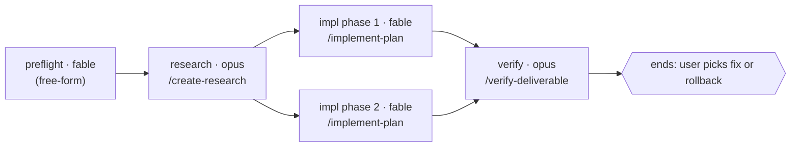

**First, ensure the artifact store symlink exists in this worktree** (idempotent — re-running is a no-op):

```bash
# Ensure the planning-harness artifact store is linked into this worktree
if [ ! -L .artifacts ]; then
  MAIN=$(git worktree list --porcelain | head -1 | sed 's/worktree //')
  REPO=$(basename "$MAIN")
  # Store lives under the Orca workspaces root (an "allowed root") so Orca's file
  # explorer can open it; one physical store shared by all worktrees of this repo.
  STORE="$HOME/orca/workspaces/$REPO/.artifacts-store"
  mkdir -p "$STORE/archive"
  ln -sfn "$STORE" .artifacts
fi
```

# Create Workflow

You are turning a piece of work — a fleshed-out plan, an investigation, or a free-form ask — into a Claude `Workflow` the user can see, correct, and approve **before** any tokens are spent running it. Three beats, in order: **draft** a stage graph, **ratify** it with the user, **launch** it.

The user's approval of the workflow doc is the sign-off, in every repo. Never read or claim launch authority from repo state; never launch before approval.

## What separates a good workflow from a bad one (read this before drafting)

**The decomposition is the product.** Work backwards from the end goal: what are the required steps, which ones truly depend on which, what blocks what, what can run side by side. The graph you propose is the one that **maximizes parallel work subject to real dependencies** — not the order the plan happened to list its phases in. Every edge must be a dependency you can defend in one clause; an edge you can't defend is a serialization the user should question, so cut it.

**A human decision point is a boundary, not a node.** A running workflow cannot pause for a person. When the work needs a judgment only the user can make, the workflow *ends there* and returns exactly what the user needs to decide; the next workflow starts from that decision. Name every boundary in the doc ("ends at: choose which of the two designs to implement"). Never bury a user judgment inside an agent prompt.

**The first node proves the run's live dependencies.** List what the run touches that can be dead — cloud credentials, API tokens, database or warehouse access, a service that has to be reachable — and give the first node the job of proving each one with a real call before anything fans out. A dependency found dead in node 1 costs one cheap agent; found in node 5 it costs every node that already ran against missing data. Credentials that refresh through an interactive browser login are the sharp case: a subagent can never satisfy one, so a dead one is an immediate stop-and-surface for the user, not something a node retries. This is the one node that is free-form by default — no skill owns "prove these credentials are alive" — so its stanza says that instead of naming a near-miss skill.

**Every node delegates to a skill unless its stanza says why it can't.** Give each node the skill that already owns its job (`/create-research`, `/implement-plan`, `/verify-deliverable`, …). A node may carry a free-form prompt only when its stanza names the closest skill considered and why it doesn't fit — the exception is visible in the doc, so the user approves it knowingly.

**Model policy.** Implementation nodes (anything that edits code or artifacts) run on Fable — a house rule, not a default. Research and verification nodes default to Opus; synthesis and adjudication default to Fable. The user may change any non-implementation row by editing the doc.

**Shape rules**, applied after the decomposition is settled:

1. Pipeline by default; a barrier only when a node needs *all* prior results (dedup, early-exit, cross-item comparison).
2. One agent per unit of shared evidence, not per item — fan out per item only when independent judgment is itself the job.
3. Structured output (`schema`) whenever a later node or the script parses the result; plain text only for terminal, human-read nodes.
4. Fail-closed, and mechanically so — a failed node drops its item or stops the stage; it never fabricates. For a stop-stage node, "failed" has to be something the script can test: a blocked agent almost never dies, so `agent() === null` doesn't fire — it "succeeds" by returning a handoff that *describes* the blockage. Every stop-stage node's prompt therefore says how to fail (structured output with `ok: false`, or a final message that is the single line `WORKFLOW-NODE-FAILED: <reason>`), and the script tests that field and throws. Every stanza names the polarity **and** the field checked.
5. Size door — default under 15 agents; a larger graph must say how to narrow it (a selector or cap argument).
6. Thin prompts — a node invokes its skill and passes paths and arguments; it doesn't restate the skill's procedure.
7. Name a concrete agent type per node (`codebase-locator`, `codebase-analyzer`, `codebase-pattern-finder`, `general-purpose`, …), never a catch-all — some repos deny `Agent(Explore)` and the choice costs nothing elsewhere.
8. Gates fire at the earliest edge that can catch the miss — if a later stage is meaningless without artifact X, the throw goes on the edge right after X's producer, not in a terminal gate. Stopping at node 2 costs two nodes; stopping at the pre-ship gate costs all of them. Scripts have no filesystem access, so the gate reads a field the producer returned (`rowsWritten`, `artifactPath`) — which means the producer's schema must carry it.
9. Written-not-run is declared, never implied verified — a node that authors code against a service it couldn't reach says so in its handoff ("written-not-run against BigQuery: column names and dtype round-trip unverified"), so the smoke test stays visibly owed. A silent "verified" here is how untested code reaches someone else's first real run.

---

<step index="1" name="resolve-the-input">

<instructions>
Resolve the input in this order; stop at the first that applies.

1. **A task directory** named in the arguments (`/create-workflow .artifacts/ENG-1234-foo`) or inferable from the conversation. `ls -La` it (Bash, not Glob — it may be a symlink) and read **fully** the latest plan, structure outline, TDD, or investigation charter it holds. Skip research-questions docs. Draft from that artifact.
2. **A free-form ask** in the arguments or the conversation (`/create-workflow "verify all 12 migration sites"`). Before drafting, run a short read-only context burst: fan out 2-4 fresh Agent() calls (`codebase-locator` for where things live, `codebase-analyzer` for how they work, `codebase-pattern-finder` for examples to model) in one turn, then synthesize in-session. No files, no recommendations from the subagents.
3. **Neither** → ask the user for one. Never draft from nothing.

Also read the repo's injected guidance as any session would (`AGENTS.md` / `CLAUDE.md`); it reaches the drafted workflow through the same channel, so don't restate it in node prompts.

List the skills available to invoke: `ls ~/.claude/skills .claude/skills .agents/skills 2>/dev/null` plus any plugin skills visible in the session. Node prompts may only name skills from this list.
</instructions>

</step>

<step index="2" name="draft-the-workflow-doc">

<instructions>
Read the doc template: `Read({SKILLBASE}/references/workflow_doc_template.md)`.

Write the doc to `.artifacts/TASKNAME/NN-workflow-DESCRIPTION.md` (next zero-padded `NN-` index in the task dir; `DESCRIPTION` is a 2-4 word kebab-case slug; create the task dir if the input was a free-form ask with no dir).

Work through the decomposition first, in your own reasoning, before writing any node: goal → required steps → dependencies → parallel groups → human boundaries. Then fill the template: the goal and where the workflow ends, the run-wide backstops, the live dependencies and which node proves each, the mermaid graph with its gates, and one stanza per node. Every field in a stanza is filled; a field you can't fill is a decision you haven't made yet — make it or ask.

Then hand the doc to the user with **one question** — at most one orienting line, then the question. Quote the graph so they react to the actual shape:

> I've drafted the workflow at `.artifacts/…/NN-workflow-….md` — N nodes, M of them parallel, ending at <boundary>. Does this graph match how you'd break the work down?
>
> ```mermaid
> …
> ```
>
> Edit the doc directly or tell me what to change; say "approved" when it's right.
</instructions>

<guidance>
## Mermaid node labels

Label each node `name · model<br>/skill` so the graph alone shows who runs what:



A free-form node shows `(free-form)` in place of the skill; quote that label, as above — bare parentheses inside `[…]` break some mermaid versions.

## Markdown formatting

When a markdown file contains a code block showing other markdown, use 4 backticks for the outer fence so the inner 3-backtick block doesn't close it early.
</guidance>

</step>

<step index="3" name="ratify">

<instructions>
Iterate until the user approves. Fold each answer into the doc by **re-working the affected section** — redraw the graph, rewrite the stanzas, move a ruled-out node to "Not in this workflow" — so the doc always reads as one coherent plan, never a log of edits. If the user edited the file directly, re-read it fully before continuing.

Ask **exactly one question per message**. Presenting 2-3 options to choose between is one question; stacking decisions is not.

Do not write the script or call `Workflow` until the user has said the doc is approved. If the user's changes invalidate the decomposition (a new dependency, a moved boundary), re-derive the graph rather than patching edges.
</instructions>

</step>

<step index="4" name="generate-and-launch">

<instructions>
On approval:

1. Re-read the approved doc fully — the user may have edited it.
2. Read the script skeleton: `Read({SKILLBASE}/references/script_skeleton.js)`. Generate the script from the doc: `meta.phases` from the graph's stages, one `agent()` per node with `model`, `effort`, `schema`, `agentType`, and `phase` taken from its stanza, `pipeline()` / `parallel()` exactly as the graph's dependencies dictate. Build each node's prompt with the skill-invocation form in the skeleton, appending the fail-closed clause to every stop-stage node. Wire each stanza's **failure check** as a real `throw` for a stop-stage node, or as the skeleton's drop-item filter, which discards both nulls and self-declared failures. Place the doc's gates on the edges it names, not at the end. Preflight the doc's **Live dependencies** in the first node. Save it as `.artifacts/TASKNAME/workflow-DESCRIPTION.js` beside the doc.
3. Call `Workflow` with `scriptPath` pointing at that file and any `args` the doc declares. Record the returned `runId` in the doc's **Launch** line.
4. Tell the user the run is live, where the script and doc are, and that `/workflows` shows progress. Stop — the completion notification reaches the session on its own.
</instructions>

<guidance>
The skill ends at launch. Do not poll, narrate progress, or append run results to the doc. A re-run or resume starts from the saved script (`scriptPath` + `resumeFromRunId`).
</guidance>

</step>
