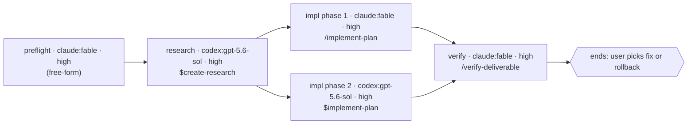

**First, ensure the artifact store symlink exists in this worktree** (idempotent — re-running is a no-op):

```bash
# Ensure the planning-harness artifact store is linked into this worktree
if [ ! -L .artifacts ]; then
  MAIN=$(git worktree list --porcelain | head -1 | sed 's/worktree //')
  REPO=$(basename "$MAIN")
  # Store lives under the Orca workspaces root (an "allowed root") so Orca's file
  # explorer can open it; one physical store shared by all worktrees of this repo.
  STORE="$HOME/orca/workspaces/$REPO/.artifacts-store"
  mkdir -p "$STORE/archive"
  ln -sfn "$STORE" .artifacts
fi
```

# Create Portable Workflow

You are turning a piece of work — a fleshed-out plan, an investigation, or a free-form ask — into one portable workflow the user can see, correct, and approve **before** any workflow nodes run. Three beats, in order: **draft** a stage graph, **ratify** it with the user, **launch** it through the resolved target.

The user's approval of the workflow doc is the sign-off, in every repo. Never read or claim launch authority from repo state; never launch before approval. The approved document is the single orchestration source; `target` controls both compilation and launch.

## What separates a good workflow from a bad one (read this before drafting)

**The decomposition is the product.** Work backwards from the end goal: what are the required steps, which ones truly depend on which, what blocks what, what can run side by side. The graph you propose is the one that **maximizes parallel work subject to real dependencies** — not the order the plan happened to list its phases in. Every edge must be a dependency you can defend in one clause; an edge you can't defend is a serialization the user should question, so cut it.

**A human decision point is a boundary, not a node.** A running workflow cannot pause for a person. When the work needs a judgment only the user can make, the workflow *ends there* and returns exactly what the user needs to decide; the next workflow starts from that decision. Name every boundary in the doc ("ends at: choose which of the two designs to implement"). Never bury a user judgment inside an agent prompt.

**The first node proves the run's live dependencies.** List what the run touches that can be dead — cloud credentials, API tokens, database or warehouse access, a service that has to be reachable — and give the first node the job of proving each one with a real call before anything fans out. A dependency found dead in node 1 costs one cheap agent; found in node 5 it costs every node that already ran against missing data. Credentials that refresh through an interactive browser login are the sharp case: a subagent can never satisfy one, so a dead one is an immediate stop-and-surface for the user, not something a node retries. This is the one node that is free-form by default — no skill owns "prove these credentials are alive" — so its stanza says that instead of naming a near-miss skill.

**Every node delegates to a skill unless its stanza says why it can't.** Give each node the skill that already owns its job (`/create-research`, `/implement-plan`, `/verify-deliverable`, …). A node may carry a free-form prompt only when its stanza names the closest skill considered and why it doesn't fit — the exception is visible in the doc, so the user approves it knowingly.

**Portable node contract.** Before the document is written, every node explicitly names:

- `backend: claude | codex`;
- a backend-native model (`fable` for Claude and `gpt-5.6-sol` for Codex are the drafting defaults);
- exact no-spend evidence that the backend supports that model: a local CLI listing/help surface or current official Anthropic/OpenAI documentation that names the identifier;
- a backend-resolvable skill, or a justified free-form prompt;
- required capabilities selected from `files`, `web`, and `commands`; and
- `effort: high`.

Ratification proves intent, not model support. Verify defaults and overrides alike. Never translate model names across providers. A missing field is invalid; a target or workflow default may not fill it invisibly.

**Portable language.** The shared graph may use `agent`, `parallel`, `pipeline`, `phase`, structured handoffs, deterministic arguments, positive budget targets used to size work, one-level nested workflows, and the existing fail-closed gates. Budget-driven control flow may use the declared total but may not depend on exact `spent()` parity. Exclude ODW-only `validate()`, native-only agent controls, `Date.now()`, and `Math.random()`.

Structured handoffs use this recursive common grammar only:

- `type` is one scalar value from `object`, `array`, `string`, `integer`, `number`, `boolean`, or `null`;
- `enum` is an array;
- `properties` is an object whose values are valid schemas;
- `required` is an array of strings;
- `additionalProperties` is boolean;
- `items` is one valid schema; and
- `minItems` is a non-negative integer.

An unsupported keyword or malformed allowed-keyword value is a compatibility failure before ratification, never something a compiler silently drops.

**Target resolution.** Assign node backends first, then resolve and persist the target before writing the draft. Use this exact precedence:

1. explicit `--target native|codex`;
2. any node has `backend: codex` → `codex`;
3. the authoring host is Codex → `codex`;
4. otherwise → `native`.

Explicit intent is not repaired. `--target native` with any Codex node is a contradiction and fails compatibility validation. A later target failure never changes the target automatically.

**Shape rules**, applied after the decomposition is settled:

1. Pipeline by default; a barrier only when a node needs *all* prior results (dedup, early-exit, cross-item comparison).
2. One agent per unit of shared evidence, not per item — fan out per item only when independent judgment is itself the job.
3. Structured output (`schema`) whenever a later node or the script parses the result; plain text only for terminal, human-read nodes.
4. Fail-closed, and mechanically so — a failed node drops its item or stops the stage; it never fabricates. For a stop-stage node, "failed" has to be something the script can test: a blocked agent almost never dies, so `agent() === null` doesn't fire — it "succeeds" by returning a handoff that *describes* the blockage. Every stop-stage node's prompt therefore says how to fail (structured output with `ok: false`, or a final message that is the single line `WORKFLOW-NODE-FAILED: <reason>`), and the script tests that field and throws. Every stanza names the polarity **and** the field checked.
5. Size door — default under 15 agents; a larger graph must say how to narrow it (a selector or cap argument).
6. Thin prompts — a node invokes its skill and passes paths and arguments; it doesn't restate the skill's procedure.
7. Agent type is optional routing/persona metadata. When a node declares one, name a concrete type (`codebase-locator`, `codebase-analyzer`, `codebase-pattern-finder`, `general-purpose`, …), never a catch-all; otherwise record `none`.
8. Gates fire at the earliest edge that can catch the miss — if a later stage is meaningless without artifact X, the throw goes on the edge right after X's producer, not in a terminal gate. Stopping at node 2 costs two nodes; stopping at the pre-ship gate costs all of them. Scripts have no filesystem access, so the gate reads a field the producer returned (`rowsWritten`, `artifactPath`) — which means the producer's schema must carry it.
9. Written-not-run is declared, never implied verified — a node that authors code against a service it couldn't reach says so in its handoff ("written-not-run against BigQuery: column names and dtype round-trip unverified"), so the smoke test stays visibly owed. A silent "verified" here is how untested code reaches someone else's first real run.
10. `agentType` is optional routing/persona metadata only. It cannot supply tools, permissions, hooks, or instructions required by the node; those come from the declared skill and must fit the backend's capabilities.

---

<step index="1" name="resolve-the-input">

<instructions>
Resolve the input in this order; stop at the first that applies.

1. **A task directory** named in the arguments (`/create-workflow .artifacts/ENG-1234-foo`) or inferable from the conversation. `ls -La` it (Bash, not Glob — it may be a symlink) and read **fully** the latest plan, structure outline, TDD, or investigation charter it holds. Skip research-questions docs. Draft from that artifact.
2. **A free-form ask** in the arguments or the conversation (`/create-workflow "verify all 12 migration sites"`). Before drafting, run a short read-only context burst: fan out 2-4 fresh subagents (`codebase-locator` for where things live, `codebase-analyzer` for how they work, `codebase-pattern-finder` for examples to model) in one turn, then synthesize in-session. No files, no recommendations from the subagents.
3. **Neither** → ask the user for one. Never draft from nothing.

Also read the repo's injected guidance as any session would (`AGENTS.md` / `CLAUDE.md`); it reaches the drafted workflow through the same channel, so don't restate it in node prompts.

List the skills available to invoke: `ls ~/.claude/skills ~/.codex/skills .claude/skills .codex/skills .agents/skills 2>/dev/null` plus any plugin skills visible in the session. Resolve each skill against its node's backend (`claude` or `codex`) plus shared `.agents/skills`; the authoring host does not make a skill portable.
</instructions>

</step>

<step index="2" name="draft-the-workflow-doc">

<instructions>
Read the doc template: `Read({SKILLBASE}/references/workflow_doc_template.md)`.

Write the doc to `.artifacts/TASKNAME/NN-workflow-DESCRIPTION.md` (next zero-padded `NN-` index in the task dir; `DESCRIPTION` is a 2-4 word kebab-case slug; create the task dir if the input was a free-form ask with no dir).

Work through the decomposition first, in your own reasoning, before writing any node: goal → required steps → dependencies → parallel groups → human boundaries. Assign each node's backend, model evidence, skill, and capabilities; validate its structured schema; resolve the target with the precedence above; then fill the template. Include the goal and boundary, resolved target, deterministic run arguments, positive budget or `none`, exact final return shape, target compatibility, run-wide backstops, live dependencies and their proving node, the mermaid graph with gates, and one complete stanza per node. Every field is filled; a field you can't fill is a decision you haven't made yet — make it or ask.

Then hand the doc to the user with **one question** — at most one orienting line, then the question. Quote the graph so they react to the actual shape:

> I've drafted the workflow at `.artifacts/…/NN-workflow-….md` — target `<native|codex>`, N nodes, M of them parallel, ending at <boundary>. Does this target and graph match how you'd break the work down?
>
> ```mermaid
> …
> ```
>
> Edit the doc directly or tell me what to change; say "approved" when it's right.
</instructions>

<guidance>
## Mermaid node labels

Label each node `name · backend:model · high<br>/skill` so the graph alone shows who runs what:



A free-form node shows `(free-form)` in place of the skill; quote that label, as above — bare parentheses inside `[…]` break some mermaid versions.

## Markdown formatting

When a markdown file contains a code block showing other markdown, use 4 backticks for the outer fence so the inner 3-backtick block doesn't close it early.
</guidance>

</step>

<step index="3" name="ratify">

<instructions>
Iterate until the user approves. Fold each answer into the doc by **re-working the affected section** — redraw the graph, rewrite the stanzas, move a ruled-out node to "Not in this workflow" — so the doc always reads as one coherent plan, never a log of edits. If the user edited the file directly, re-read it fully before continuing.

Re-resolve the target whenever a backend changes or the user supplies `--target`. A node/backend/model/skill/edge change is a graph change and returns to ratification. After approval, a same-target retry reuses its existing target-specific script only after confirming that script still matches the approved document. An explicit retry through the other target reruns target compatibility and preflight, writes the other target's sibling artifact, and replaces `target` and **Launch** coherently while preserving the unchanged approved graph; do not ask for a second abstract graph approval. Never switch targets or fall back automatically.

Ask **exactly one question per message**. Presenting 2-3 options to choose between is one question; stacking decisions is not.

Do not write the script or call `Workflow` until the user has said the doc is approved. If the user's changes invalidate the decomposition (a new dependency, a moved boundary), re-derive the graph rather than patching edges.
</instructions>

</step>

<step index="4" name="generate-and-launch">

<instructions>
On approval:

1. Re-read the approved doc fully — the user may have edited it.
2. **Target preflight.** Reconfirm the resolved target, then complete its no-spend checks before reading a compiler skeleton or writing any artifact.
   - For `native`, prove that the authoring host exposes the Claude `Workflow` capability; reject every non-Claude node; resolve each declared skill only through Claude or shared skill directories; and verify every exact model identifier, including `fable`. Local `claude --help` is acceptable evidence for `fable`; any other model needs a no-spend local listing/help surface or current official Anthropic documentation naming the exact identifier. Confirm native `effort: 'high'` support and that the Workflow host supplies every node's **Required capabilities**.
   - For `codex`, require `odw` on `PATH`, record `odw --version`, and inspect the single top-level `odw --help` output for `run`, `--config`, `--runs-root`, `--detach`, `attach`, `status`, and `result`. Do not call subcommand-help forms. If ODW is missing or lacks the required public contract, stop; never install, upgrade, vendor, or bypass it.
   - Require only the backend CLIs used by the Codex-target graph. Prove authentication with `claude auth status` and/or `codex login status`; an interactive login requirement stops and returns to the user rather than retrying. Check Claude help for `--model` and `--effort`, and Codex help for model selection plus the `-c` config override.
   - Resolve every skill only through its declared backend's runtime directory or shared `.agents/skills` entries. Verify every exact model identifier, defaults included, without a model call: Claude accepts a local listing/help surface or current official Anthropic documentation; Codex accepts a no-spend CLI model listing or current official OpenAI documentation. Authentication is not model-entitlement evidence. Never translate or probe a model with spend.
   - Validate every node's **Required capabilities** against its selected adapter. ODW Claude supports `files` and `web`, not `commands`; reject a command-requiring Claude node. ODW Codex supports `files`, `web`, and `commands`. Never widen Claude to `--dangerously-skip-permissions` against the real repository.
   - Revalidate each structured handoff recursively against the portable grammar and reject every unsupported schema keyword, unsupported scalar or union `type`, or malformed allowed-keyword value. Require every declared budget to be a positive number used only as an estimated ODW output ceiling. Confirm the installed ODW public contract exposes per-node `adapter` and `model`; otherwise return its version and the missing capability.
   - Every failure names the target, failing node or dependency, exact evidence command, and explicit recovery. A preflight failure writes no script/config, changes no target, invokes no model, and starts no run.
3. **Target compilation.** Select exactly one compiler from the approved `target`; never generate both targets in one invocation.
   - For `native`, reject any non-Claude node before writing. Read only `Read({SKILLBASE}/references/script_skeleton.js)` and write `.artifacts/TASKNAME/workflow-DESCRIPTION.native.js`.
   - For `codex`, read `Read({SKILLBASE}/references/odw_script_skeleton.js)` and `Read({SKILLBASE}/references/odw_config_skeleton.json)`. Write `.artifacts/TASKNAME/workflow-DESCRIPTION.codex.js` plus `.artifacts/TASKNAME/workflow-DESCRIPTION.codex.odw.json`; render only the adapters the approved graph uses.
   - Before writing, derive the emitted node IDs, dependency edges, and final return shape and compare them with the approved graph and **Return shape**. Stop on any missing, added, reordered, or reinterpreted node, edge, field, or return value. Generate `meta.phases`, prompts, schemas, models, routing metadata, failure checks, edge gates, deterministic arguments, budget sizing, portable primitives, and the terminal return directly from the approved document. Preflight the doc's **Live dependencies** in its first node.
   - Never overwrite the sibling artifact for the other target. A later explicit compile through that target writes its sibling and leaves the first artifact unchanged.
4. **Target launch — codex.** From the repository root, launch exactly one detached ODW run with the generated script and standalone config. Use one absolute task-local run-store path and persist that same path in the document:

   ```bash
   odw_runs_root='<absolute-repo-root>/.artifacts/TASKNAME/.odw-runs'
   odw_run_id=$(odw run .artifacts/TASKNAME/workflow-DESCRIPTION.codex.js \
     --config .artifacts/TASKNAME/workflow-DESCRIPTION.codex.odw.json \
     --runs-root "$odw_runs_root" \
     --detach \
     --args '<serialized approved args>')
   ```

   Omit `--args` when the document declares none. Add `--budget <positive-number>` only when declared, and describe it as ODW's estimated output ceiling rather than exact token accounting. A non-zero exit or empty run ID is a launch failure; preserve both generated artifacts for inspection and do not claim a live run. Record `codex ODW <run-id> · <script-path> · <config-path> · <runs-root>` in the document's **Launch** line.
5. **Target launch — native.** Call `Workflow` with `scriptPath` pointing at `workflow-DESCRIPTION.native.js` and pass the exact deterministic arguments and positive budget declared by the approved document. Record `native Workflow <run-handle> · <script-path>` in the document's **Launch** line.
6. After a Codex launch, return immediately with the exact rendered commands below, using the recorded run ID and the same absolute `--runs-root` as launch:

   ```bash
   odw attach <run-id> --runs-root '<absolute-runs-root>'
   odw status <run-id> --runs-root '<absolute-runs-root>'
   odw result <run-id> --runs-root '<absolute-runs-root>'
   ```

   Do not poll. Do not call `attach`, `status`, `logs --follow`, or `result` on the user's behalf, and do not install a watcher.
7. After a native launch, tell the user the run is live, name the script and document paths, and say that `/workflows` shows progress. Stop immediately; do not poll or append results. The completion notification reaches the session on its own.
</instructions>

<guidance>
The skill ends at launch. Do not poll, narrate progress, or append run results to the doc. A same-target re-run starts from the checked saved script; native resume may also use its saved `scriptPath` plus `resumeFromRunId`. Cross-target retry follows the ratified retry contract above and keeps both sibling artifacts.
</guidance>

</step>
