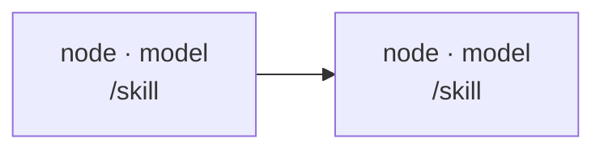

# Workflow: [2-6 word name]

**Goal:** [one sentence — what is true when this workflow returns]
**Ends at:** [the human boundary — what the user decides with the result, or "terminal: no decision pending"]
**Input:** [the artifact or ask this was drafted from]
**Launch:** [empty until launched; then `runId` + script path]

### Backstops

[Deterministic checks that already cover a failure class, stated once so no node re-runs them: tests, lint, schema validation, CI, parity checks. "None" if none.]

### Live dependencies

[Everything outside this repo the run has to reach — cloud credentials, API tokens, warehouse or DB access, a service that must be up. One line each: the dependency, the cheapest call that proves it alive, and the node that runs that call (normally the first). Mark any whose refresh needs an interactive browser login — a subagent can never satisfy one, so a dead one stops the run and comes back to the user rather than being retried. "None — repo-local only" if none.]

### Graph

[One line per edge that isn't obvious: "B after A because B reads A's file list."]
[One line per parallel group: "I1 ‖ I2 — disjoint files."]
[One line per gate, placed on the earliest edge that can catch the miss: "after M: throw unless `M.rowsWritten > 0` — F and V are meaningless without the measurement table."]

### Nodes

#### [node id] — [name]

- **Purpose:** [the decision or artifact this node owns]
- **Skill:** `/skill-name` [args it's passed] — or — free-form; closest skill considered: `/x`, doesn't fit because […] (the preflight node is free-form by default — no skill owns proving credentials; say that and move on)
- **Agent type:** [codebase-analyzer | general-purpose | …]
- **Model / effort:** [fable | opus] / [low | medium | high]
- **Context:** fresh | fork — [why]
- **Count:** [1, or N per what, and why that unit]
- **Input:** [paths / fields it reads]
- **Handoff:** [schema fields or file it returns for the next node; "plain text, human-read" for terminal nodes. If this node can author code against a service it might not reach, its handoff carries a written-not-run line — "written-not-run against <service>: <what a smoke test still owes>" — instead of claiming verification.]
- **Failure polarity:** drop item | stop stage | keep with error
- **Failure check:** [the field the script tests and what it does — "`ok:false` or `rowsWritten == 0` → `throw`", "`null` → drop from the list". A stop-stage node also names how it *declares* failure (`ok:false` + `blocked`, or the `WORKFLOW-NODE-FAILED: <reason>` line) — a handoff that merely describes the blockage is a failure, not a result, and the script must be able to tell.]
- **Checkpoint:** [output paths + sentinel if a later stage reuses it; "none — terminal" otherwise]
- **Est. tokens:** [number and the assumption behind it]

#### …

### Not in this workflow

- [work that was considered and left out, with the reason — especially anything that belongs after the human boundary]
