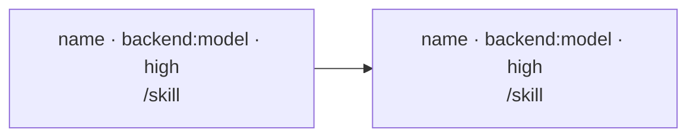

# Workflow: [2-6 word name]

**Goal:** [one sentence — what is true when this workflow returns]
**Ends at:** [the human boundary — what the user decides with the result, or "terminal: no decision pending"]
**Input:** [the artifact or ask this was drafted from]
**Arguments:** [`none`, or the exact deterministic JSON value passed for this run; no time-, environment-, or randomness-derived defaults]
**Budget:** [`none`, or one positive number plus the sizing assumption; for ODW this is an estimated output ceiling, not exact accounting]
**Return shape:** [the exact final scalar, array, or object shape, including every field and the node/result that supplies it]
**Launch:** [one of: `pending`; `native Workflow <run-handle> · <script-path>`; `codex ODW <run-id> · <script-path> · <config-path> · <runs-root>`]

### Target compatibility

- `native` accepts only nodes with `backend: claude`.
- `codex` accepts nodes with `backend: claude` or `backend: codex` in one graph.
- [State that every node is compatible with the resolved target, or name the incompatible node and stop before ratification. Never switch targets to repair an incompatible graph.]

### Retry semantics

- Same target: reuse its existing target-specific script only after confirming it still matches this approved document.
- Other target: only on an explicit request, rerun target compatibility and preflight, write the sibling target artifact, and replace `target` plus **Launch** coherently without a second graph approval.
- Any node, backend, model, skill, or edge change returns this workflow to ratification. Never fall back to another target automatically.

### Backstops

[Deterministic checks that already cover a failure class, stated once so no node re-runs them: tests, lint, schema validation, CI, parity checks. "None" if none.]

### Live dependencies

[Everything outside this repo the run has to reach — cloud credentials, API tokens, warehouse or DB access, a service that must be up. One line each: the dependency, the cheapest call that proves it alive, and the node that runs that call (normally the first). Mark any whose refresh needs an interactive browser login — a subagent can never satisfy one, so a dead one stops the run and comes back to the user rather than being retried. "None — repo-local only" if none.]

### Graph

[One line per edge that isn't obvious: "B after A because B reads A's file list."]
[One line per parallel group: "I1 ‖ I2 — disjoint files."]
[One line per gate, placed on the earliest edge that can catch the miss: "after M: throw unless `M.rowsWritten > 0` — F and V are meaningless without the measurement table."]

### Nodes

#### [node id] — [name]

- **Purpose:** [the decision or artifact this node owns]
- **Backend:** `claude | codex`
- **Model:** [exact backend-native model identifier; required]
- **Model evidence:** [no-spend CLI model listing/help evidence, or current official backend URL + checked date, naming the exact model identifier]
- **Effort:** `high`
- **Skill:** [backend-resolvable `/skill-name` for Claude or `$skill-name` for Codex, plus its arguments; otherwise `free-form` with the closest skill considered and why it does not fit. Resolve against this node's backend, not the authoring host. The preflight node is free-form by default because no skill owns proving credentials.]
- **Required capabilities:** [one or more of `files`, `web`, and `commands`, derived from the skill or free-form prompt]
- **Agent type:** [optional routing/persona hint, or `none`; it cannot provide tools, permissions, hooks, or instructions required by the node]
- **Count:** [1, or N per what, and why that unit]
- **Input:** [paths / fields it reads]
- **Handoff:** [schema fields or file it returns for the next node, using the portable schema grammar below; `plain text, human-read` for terminal nodes. If this node can author code against a service it might not reach, its handoff carries a written-not-run line — `written-not-run against <service>: <what a smoke test still owes>` — instead of claiming verification.]
- **Failure polarity:** drop item | stop stage | keep with error
- **Failure check:** [the field the script tests and what it does — "`ok:false` or `rowsWritten == 0` → `throw`", "`null` → drop from the list". A stop-stage node also names how it *declares* failure (`ok:false` + `blocked`, or the `WORKFLOW-NODE-FAILED: <reason>` line) — a handoff that merely describes the blockage is a failure, not a result, and the script must be able to tell.]
- **Checkpoint:** [output paths + sentinel if a later stage reuses it; "none — terminal" otherwise]
- **Est. tokens:** [number and the assumption behind it]

#### …

### Portable handoff schema grammar

[For every structured handoff, use only this recursive grammar: `type` is one scalar value from `object`, `array`, `string`, `integer`, `number`, `boolean`, or `null`; `enum` is an array; `properties` is an object whose values are recursively valid schemas; `required` is an array of strings; `additionalProperties` is a boolean; `items` is one recursively valid schema; and `minItems` is a non-negative integer. Any other keyword or malformed allowed-keyword value is incompatible. Write `none — no structured handoffs` when this workflow has none.]

### Not in this workflow

- [work that was considered and left out, with the reason — especially anything that belongs after the human boundary or requires a target-only primitive outside the portable contract]
